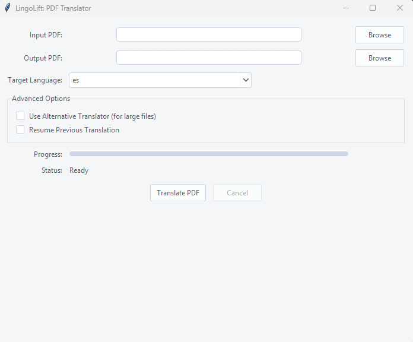
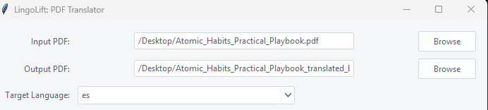
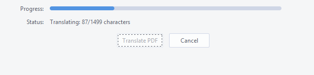

# 🌐 LingoLift

**LingoLift** is a lightweight desktop tool that lets you translate PDF files into your desired language — right from your local machine.

Whether you're a traveler, student, researcher, or professional, LingoLift gives you **on-the-go PDF translation** without needing to copy and paste chunks of text into online tools.

---

## 🚀 Features

- 📄 Translate entire PDFs in one go
- 🌍 Choose any target language
- 🎯 Simple and intuitive interface
- ⚙️ Fully offline after installation
- 💾 Save translated text as a clean PDF

---

## 📝 Disclaimer

This app is designed for quick, portable translations. For high-fidelity formatting or advanced document layouts (e.g., scientific papers, complex PDFs), **integrity-preserving support is planned for future releases.**

---

### 🖼️ UI Previews

#### 🧭 Main Interface  


#### 🌍 Language Selection  


#### 🔄 Progress  


#### ✅ Translation Complete  


---

## 🛠️ Usage

1. Clone the repository  
   ```bash
   git clone https://github.com/Garuda8887/lingolift.git
   cd lingolift
   ```

2. (Optional) Create a virtual environment  
   ```bash
   python -m venv venv
   source venv/bin/activate  # or venv\Scripts\activate on Windows
   ```

3. Install dependencies  
   ```bash
   pip install -r requirements.txt
   ```

4. Run the app  
   ```bash
   python lingolift.py
   ```

---

## 🌍 Supported Languages

Supports all languages provided by [Google Translate](https://cloud.google.com/translate/docs/languages).

---

## 📦 Dependencies

- `PyPDF2`
- `googletrans`
- `reportlab`
- `tkinter`
- `ttkthemes`

---

## 🤝 License

MIT License © [Garuda8887](https://github.com/Garuda8887)